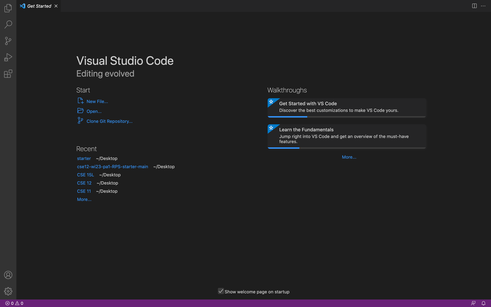
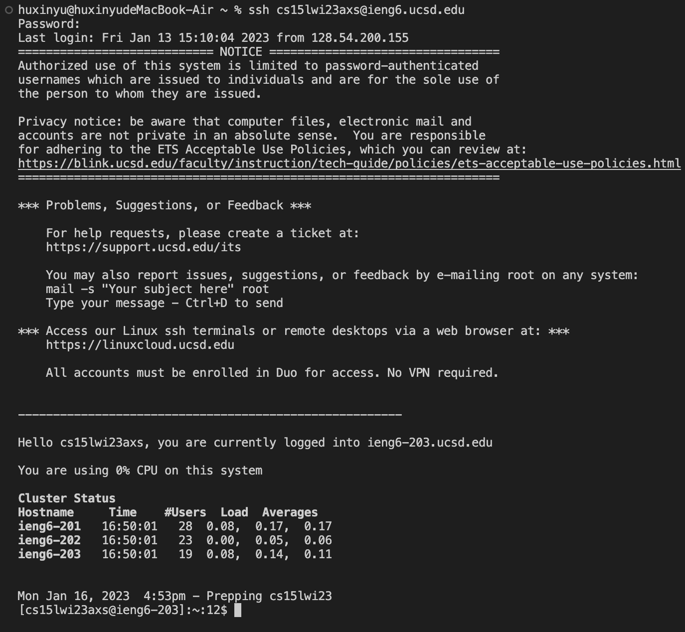
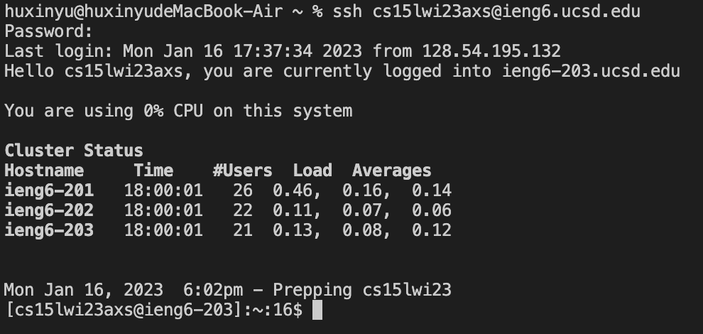
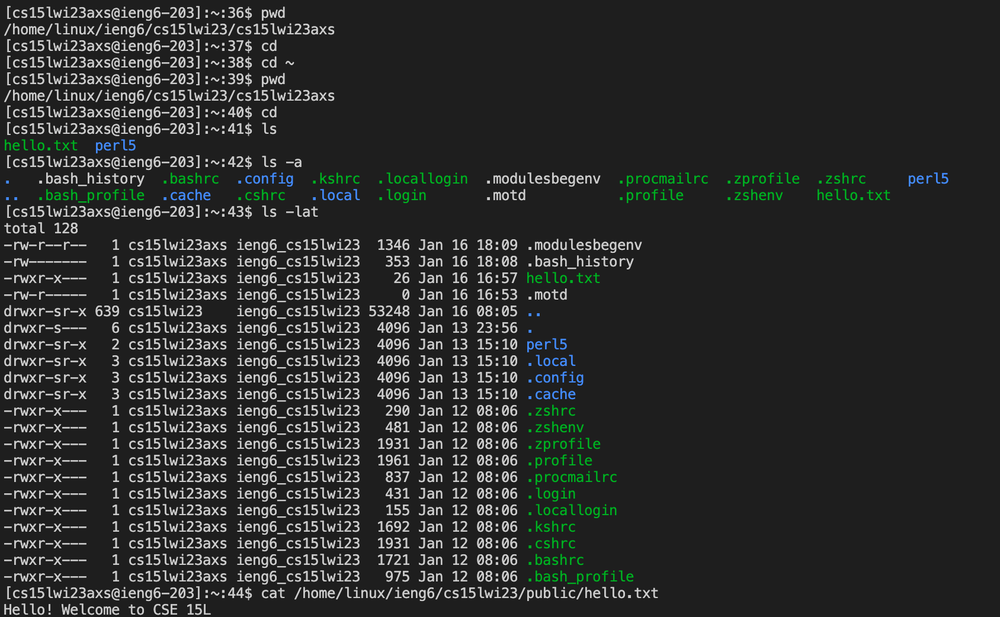

# Week 1 Lab Report

## Installing VScode
Go to the Visual Studio Code website [Link](http://code.visualstudio.com/), choose the correct version and then follow the instructions to download and install it on the computer. 

When it is installed, you should be able to open a window that looks like this. 



## Remotely Connecting
If you are on Windows, first install `git` for Windows. Once installed, use following steps to set the default terminal: 

1. Open Visual Studio Code and use `Ctrl` + ``` (or use the Terminal -> New Terminal menu option) to open the terminal. 
2. Open the command palette using `Ctrl` + `Shift` + `P`.
3. Select Default Profile and select Git Bash from the options.
4. Click on the + icon in the terminal window. 
5. The new terminal now will be a Git Bash terminal. 

To connect remotely, you should login to this website https://sdacs.ucsd.edu/~icc/index.php and reset your password for your account. Then, open a terminal in VScode and type `ssh cs15lwi23zz@ieng6.ucsd.edu` in the terminal (replace `zz` with the letters in your course-specific account). Then, give your password which you are not able to see it. Once logined, you should be able to see something that looks like the screenshot below.




## Trying Some Commands
You can run some commands both on your computer and on the remote computer after login. 


* `pwd` prints the current working directory
* `cd` switches the current working directory to the given path
* `ls` lists the files and forlders of the given path
* `cat` prints the contents of one or more files given by the paths
* `mkdir` makes a new directory

To log out of the remote server in your terminal, you can use: 
* Ctrl-D
* Run the command `exit`
