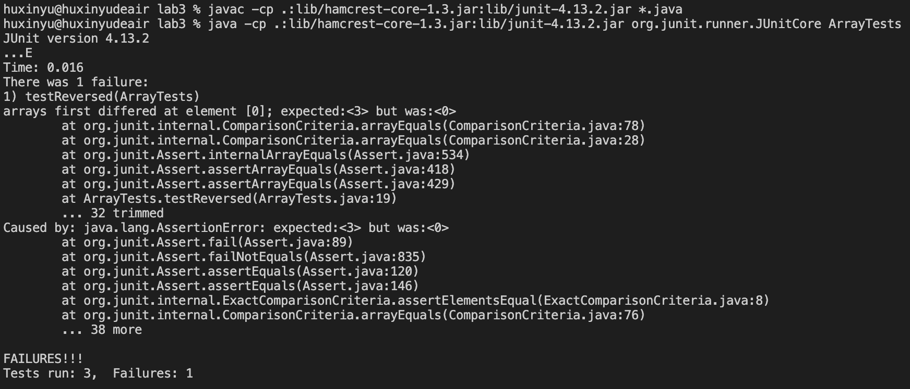

# Lab Report 2 - Servers and Bugs (Week 3)

## Part 1


* Which methods in your code are called?
handleRequest

* What are the relevant arguments to those methods, and the values of any relevant fields of the class?
relevant argument: url
values of relevant fields: URI url, String concatenatedString, String[] parameters

* How do the values of any relevant fields of the class change from this specific request? If no values got changed, explain why.
If the path of url is equal to "/add-message", get the query of the url and split it by "=", named parameters. If the first element of the parameters is equal to "s", add the first element to concatenatedString with new lines.


## Part 2
Debug for ArrayMethods

A failure-inducing input for the buggy program, as a JUnit test and any associated code (write it as a code block in Markdown)
```
@Test
  public void testReversed() {
    int[] input2 = {1, 2, 3};
    assertArrayEquals(new int[]{3, 2, 1}, ArrayExamples.reversed(input2));
  }
```

An input that doesn’t induce a failure, as a JUnit test and any associated code (write it as a code block in Markdown)
```
@Test
  public void testReversed() {
    int[] input1 = { };
    assertArrayEquals(new int[]{ }, ArrayExamples.reversed(input1));
  }
```

The symptom, as the output of running the tests (provide it as a screenshot of running JUnit with at least the two inputs above)


The bug, as the before-and-after code change required to fix it (as two code blocks in Markdown)

