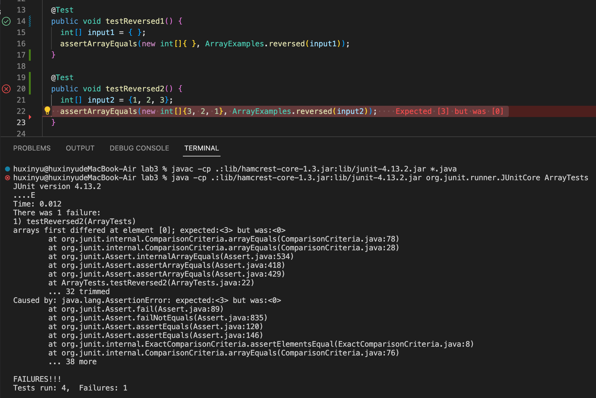

# Lab Report 2 - Servers and Bugs (Week 3)

## Part 1


* Which methods in your code are called?

  handleRequest and main methods

* What are the relevant arguments to those methods, and the values of any relevant fields of the class?

  relevant argument: url and args

  values of relevant fields: URI url, String concatenatedString, String[] parameters

* How do the values of any relevant fields of the class change from this specific request? If no values got changed, explain why.

  If the path of url is equal to "/add-message", get the query of the url and split it by "=", named parameters. If the first element of the parameters is equal to "s", add the first element to concatenatedString with new lines. For example, the concatenatedString is empty initially, and when we add the element to it, concatenatedString changes from "" to "Hello", and later to "Hello How are you" in different lines. 


## Part 2
reversed method in ArrayExamples

A failure-inducing input for the buggy program, as a JUnit test and any associated code (write it as a code block in Markdown)
```
@Test
  public void testReversed() {
    int[] input2 = {1, 2, 3};
    assertArrayEquals(new int[]{3, 2, 1}, ArrayExamples.reversed(input2));
    
    int[] input3 = {5, 5, 6, 7, 8}; 
    assertArrayEquals(new int[]{8, 7, 6, 5, 5}, ArrayExamples.reversed(input3));
  }
```

An input that doesn’t induce a failure, as a JUnit test and any associated code (write it as a code block in Markdown)
```
@Test
  public void testReversed() {
    int[] input1 = { };
    assertArrayEquals(new int[]{ }, ArrayExamples.reversed(input1));
  }
```

The symptom, as the output of running the tests (provide it as a screenshot of running JUnit with at least the two inputs above)


The bug, as the before-and-after code change required to fix it (as two code blocks in Markdown)
```
  static int[] reversed(int[] arr) {
    int[] newArray = new int[arr.length];
    for(int i = 0; i < arr.length; i += 1) {
      arr[i] = newArray[arr.length - i - 1];
    }
    return arr;
  }
```

```
  static int[] reversed(int[] arr) {
    int[] newArray = new int[arr.length];
    for(int i = 0; i < arr.length; i += 1) {
      newArray[i] = arr[arr.length - i - 1];
    }
    return newArray;
  }
```

The before code creates a new empty array with the same length as arr, but in the for loop, the rightside of the "=" gives the values to the leftside. Thus, in before code, arr becomes empty. In after code, arr gives all its elements to newArray in reversed order, that is, newArray copies every element in arr in reversed order. Therefore, the array returned is not empty and contains all element of the input array in reversed order. 


## Part 3
In week 2, I learned to create a simple web server which could be shared with other computers, so everyone could increment numbers by that url. 
In week 3, I learned to wrote testcases by myself to check and debug the code. 
