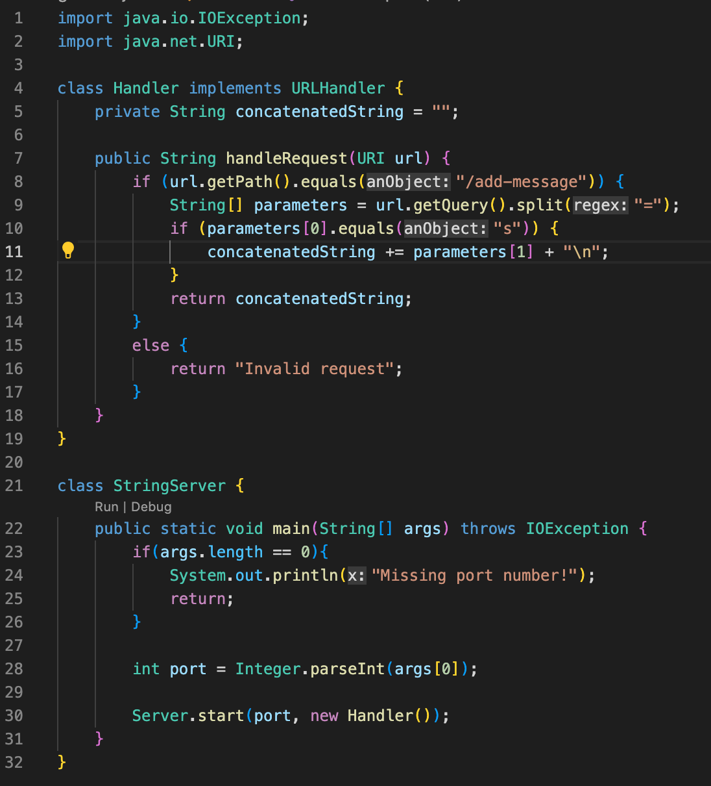
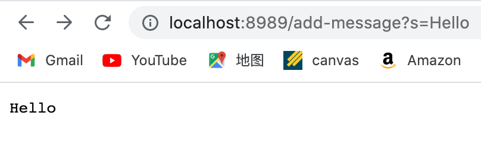
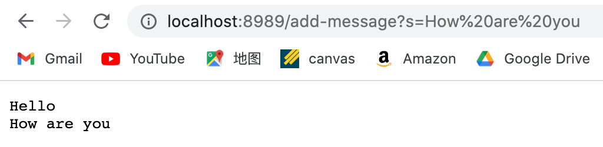

# Lab Report 2 - Servers and Bugs (Week 3)

## Part 1

* Which methods in your code are called?

* What are the relevant arguments to those methods, and the values of any relevant fields of the class?

* How do the values of any relevant fields of the class change from this specific request? If no values got changed, explain why.
