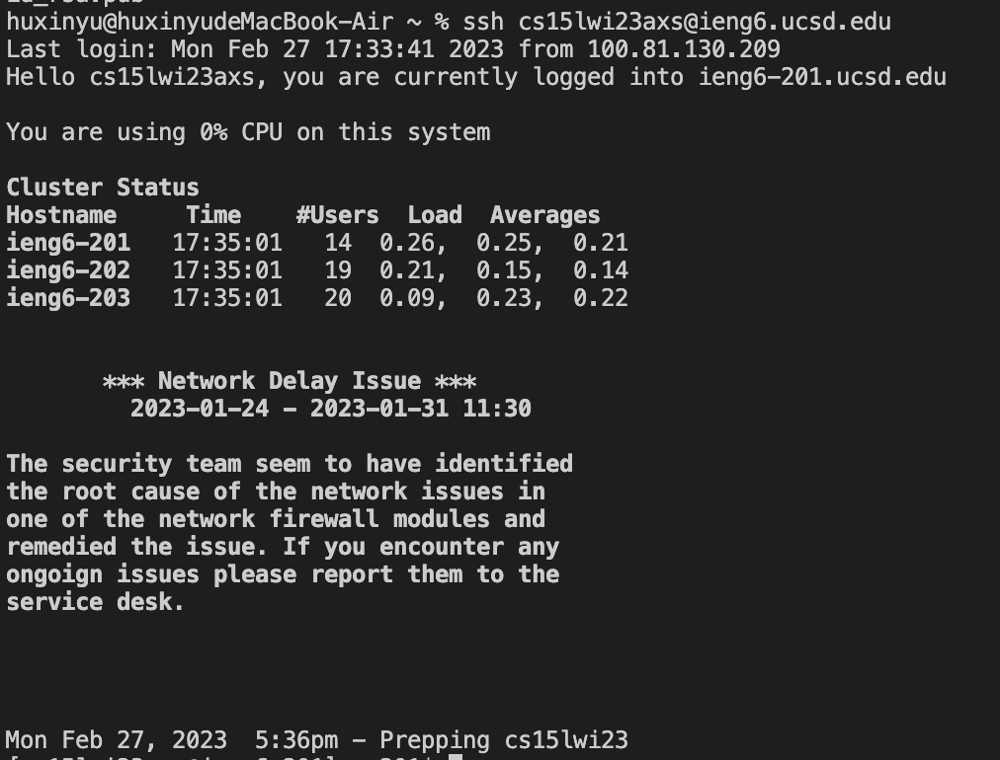
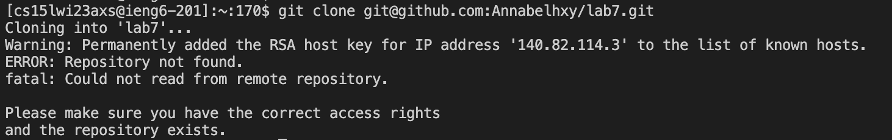
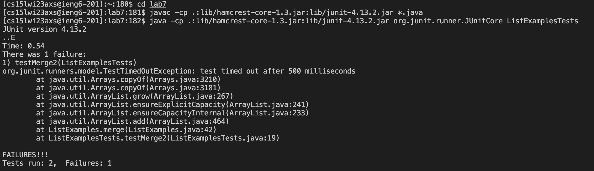
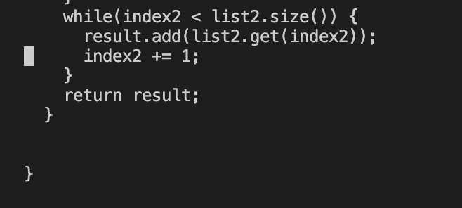
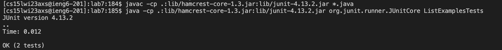
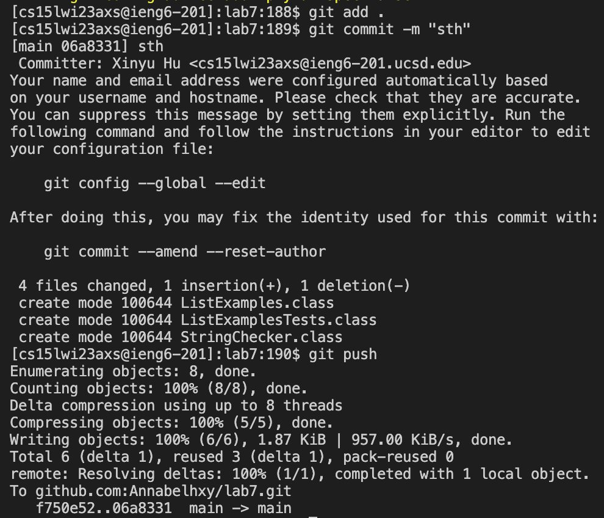

# Lab Report 4
## Step 4: Log into ieng6

Press `Ctrl-R` to search command history, and then start typing part of a command `"s"`. Then, `ssh cs15lwi23axs@ieng6.ucsd.edu` shows up and press `<Enter>`. Thus, we can log into our ieng6 account without password. 

## Step 5: Clone your fork of the repository from your Github account

Firstly, type `git clone` in the terminal. Then, go to the lab7 repository and click code and then click SSH, and then click the copy to copy the password-protected SSH key. Then, copy the SSH key from the Github account and press `<Enter>`. Then, the clone starts. 

## Step 6: Run the tests, demonstrating that they fail

Firstly, `cd lab7` to change the directory to lab7. Then, complie the ListExamplesTests to run the tests by typing the commands `javac -cp .:lib/hamcrest-core-1.3.jar:lib/junit-4.13.2.jar *.java` and `java -cp .:lib/hamcrest-core-1.3.jar:lib/junit-4.13.2.jar org.junit.runner.JUnitCore ListExamplesTests`. Then, the tests fail. 

## Step 7: Edit the code file to fix the failing test

First, type `nano ListExamples.java` and press `<Enter>` to get to the code. Then, go to the bottom of the code by holding `<down>` arrow and change the line `index1 += 1` to `index2 += 1` directly. Next, press `Ctrl-X` and type `y` and then press `<Enter>` to save and exit the code file. Thus, the error is fixed so we can run the tests. 

## Step 8: Run the tests, demonstrating that they now succeed

The `javac -cp .:lib/hamcrest-core-1.3.jar:lib/junit-4.13.2.jar *.java` command is 3 up in the search history, so I use up arrow to access it by pressing `<up><up><up><Enter>`. Then the `java -cp .:lib/hamcrest-core-1.3.jar:lib/junit-4.13.2.jar org.junit.runner.JUnitCore ListExamplesTests` command is 3 up in the history, so I access and run it in the same way by pressing `<up><up><up><Enter>`. Then, the tests succeed. 

## Step 9: Commit and push the resulting change to your Github account

Firstly, type and enter `git add .` and then type and enter `git commit -m "sth"` to commit the change to the Github account. Then, type and press `git push` to push the resulting change to the Github account. Thus, we finish. 
